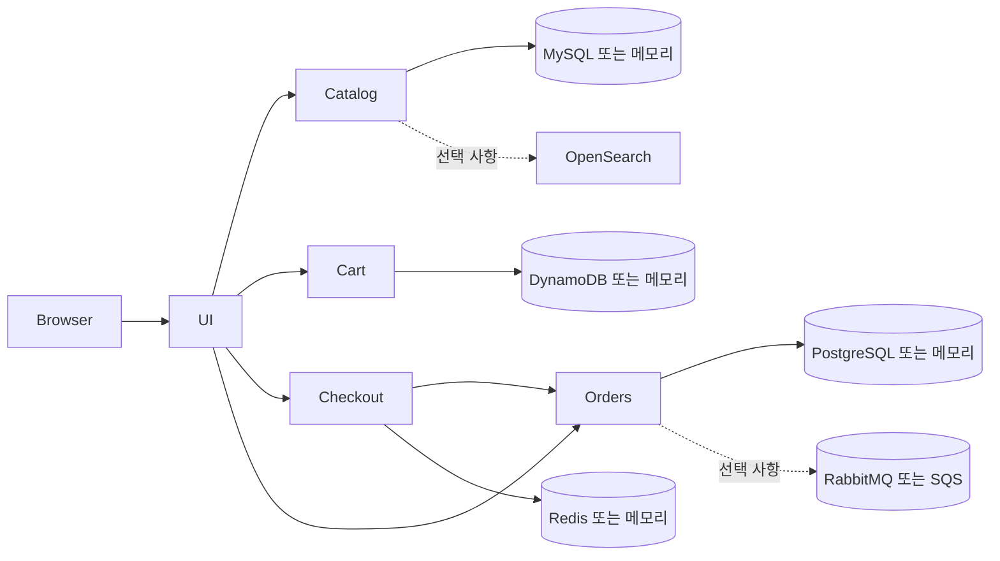

# 프로젝트 개요

## 분석 기준점

| 항목 | 값 |
| --- | --- |
| 저장소 루트 | `app/` |
| 브랜치 | `main` |
| HEAD | `62289b99b13aa9e2cd413ef6d18491d151760bee` |
| 원격 저장소 | `origin` → `https://github.com/AWSome-BIT-Bespin/retail-store-app.git` |
| 분석 시작 시 작업 트리 | 깨끗한 상태 |
| Source of Truth | 현재 로컬 저장소 |
| 업스트림 참고 | AWS Containers Retail Sample |

이 저장소는 AWS Retail Store Sample App의 일부를 기반으로 수정한 애플리케이션이다. 실행 가능한 서비스는 UI, Catalog, Cart, Checkout, Orders 다섯 개다. 저장소 최상위에 통합 Compose, Terraform, CI/CD 설정은 없으며 각 서비스가 Dockerfile, Compose, Helm chart를 개별 소유한다.

## 기술 스택

| 서비스 | 언어 / 프레임워크 | 기본 포트 | 역할 |
| --- | --- | ---: | --- |
| UI | Java 21, Spring Boot WebFlux, Spring Security, Thymeleaf, Kiota | 8080 | 서버 렌더링 상점 화면, 세션 로그인, 백엔드 API 클라이언트 |
| Catalog | Go, Gin | 8080 | 상품·태그·선택적 검색 API |
| Cart | Java 21, Spring Boot, Spring Data | 8080 | 세션/고객 기준 장바구니 API |
| Checkout | TypeScript, NestJS | 8080 | Checkout 상태, 배송 계산, 주문 제출 |
| Orders | Java 21, Spring Boot, Spring Data JDBC | 8080 | 주문·사용자 저장, 주문·인증 API, 주문 생성 이벤트 |

## 저장소 구조

```text
app/
├── README.md                       # 내용은 "APP REPO"뿐
├── src/
│   ├── ui/                         # 활성 UI 서비스
│   ├── catalog/                    # Go Catalog 서비스
│   ├── cart/                       # Cart 서비스
│   ├── checkout/                   # Checkout 서비스
│   ├── orders/                     # Orders 서비스
│   └── ui-backup/                  # 활성 코드에서 참조를 찾지 못한 UI 스냅샷
└── docs/code-analysis/             # 본 문서 모음
```

## 논리적 실행 구조



화살표는 설정에 따라 활성화된다. UI endpoint가 비어 있으면 Catalog·Cart·Checkout·Recommendations는 mock 구현을 사용한다. Orders는 mock 목록·인증 API가 없으므로 endpoint가 비어 있으면 로그인·회원가입·`/demo/orders`가 실제 연동되지 않는다. Checkout의 Orders endpoint가 비어 있으면 Checkout은 mock Orders 구현을 사용한다.

서비스별 README는 존재하지만, 최상위 README는 운영 문서 역할을 하지 않는다.
