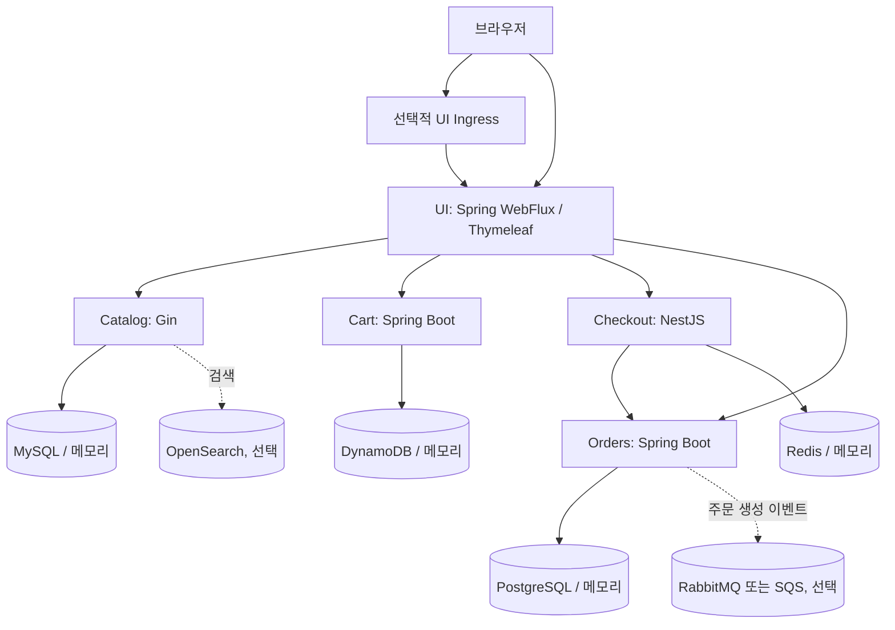

# 현재 아키텍처

문서의 모든 경로는 `app/` 저장소 루트 기준이다.

## 전체 구조

UI chart에는 Ingress 템플릿이 있으나 기본값은 비활성화다. 전역 Ingress·Load Balancer 설정은 저장소에서 발견되지 않았다. 따라서 외부 접근 경로는 UI Helm values 또는 UI Compose 포트 매핑에 따라 달라진다.

## 서비스 경계

| 서비스 | HTTP 표면 | 저장소 선택지 | 외부 의존성 |
| --- | --- | --- | --- |
| UI | `/catalog`, `/cart`, `/checkout`, `/login`, `/register`, `/demo/orders` 등 HTML 경로 | 자체 DB 없음, WebSession 기반 로그인 세션 | Catalog, Cart, Checkout, Orders, 선택적 Recommendations |
| Catalog | `/catalog/*`, `/health`, `/topology`, `/metrics` | 메모리 JSON, MySQL | 선택적 OpenSearch |
| Cart | `/carts/{customerId}/*`, Actuator, `/topology`, `/chaos` | 메모리, DynamoDB | 없음 |
| Checkout | `/checkout/{customerId}/*`, `/health`, `/topology`, `/metrics`, `/chaos` | 메모리, Redis | 선택적 Orders |
| Orders | `/orders`, `/users`, `/auth/login`, Actuator, `/topology`, `/chaos` | 메모리, PostgreSQL | 메모리/RabbitMQ/SQS 이벤트 공급자 |

## Kubernetes에 존재하는 구조

각 서비스 chart는 기본적으로 `Deployment`와 `ClusterIP Service`를 생성한다. Service는 포트 `80`으로 받고 이름 있는 HTTP 컨테이너 포트 `8080`으로 전달한다.

* UI: `src/ui/chart/`; 표준 Ingress와 Istio gateway/virtual-service 템플릿 포함
* Catalog: `src/catalog/chart/`; 선택적 MySQL·OpenSearch StatefulSet 포함
* Cart: `src/cart/chart/`; 선택적 DynamoDB Local Deployment 포함
* Checkout: `src/checkout/chart/`; 선택적 Redis Deployment 포함
* Orders: `src/orders/chart/`; 선택적 PostgreSQL·RabbitMQ StatefulSet 포함

서비스 간 endpoint를 한 번에 연결하는 활성 values 파일은 없다. `src/ui/chart/values.yaml`의 endpoint 예시는 주석이며 기본값도 비어 있다. 배포 시 실제 Kubernetes Service 이름과 포트를 values로 명시해야 한다.

## 관찰성·복원력

| 관심사 | 현재 구현 |
| --- | --- |
| Health | UI/Cart/Orders는 Spring Actuator readiness, Catalog는 `/health`, Checkout은 Terminus `/health` |
| Metrics | UI/Cart/Orders는 Actuator Prometheus, Catalog는 Gin Prometheus `/metrics`, Checkout은 `@willsoto/nestjs-prometheus` |
| Tracing | UI HTTP client는 OpenTelemetry 계측, Catalog는 `OTEL_SERVICE_NAME`이 있을 때만 OTLP/X-Ray 초기화, Checkout은 `nestjs-otel` 로드 |
| Chaos | Cart·Checkout·Orders·Catalog에 chaos 제어/미들웨어 존재 |
