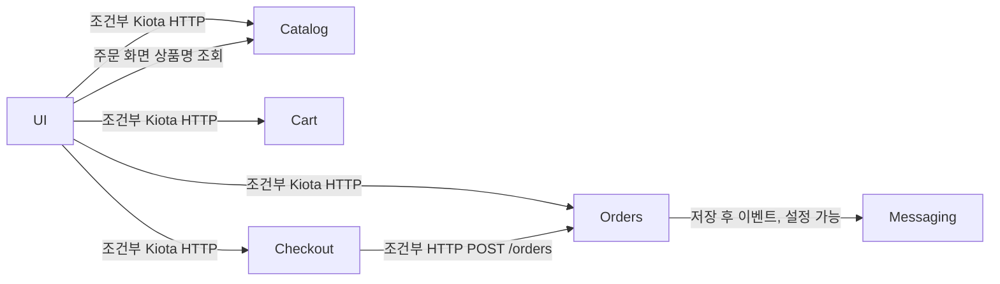

# 서비스 의존성

## 의존성 그래프

UI에는 Recommendations client와 설정이 있으나 `app/src`에 Recommendations 서비스 소스·chart는 없다. endpoint가 비어 있으면 UI는 mock을 사용한다.

## HTTP 의존성

| Caller | Target | Protocol / endpoint | 설정 | 호출 위치 | 실패 시 |
| --- | --- | --- | --- | --- | --- |
| UI | Catalog | `/catalog/products`, `/catalog/products/{id}`, `/catalog/tags`, `/catalog/size`, `/catalog/search` | `RETAIL_UI_ENDPOINTS_CATALOG` | `services/catalog/KiotaCatalogService.java` | Reactor 오류 전파, endpoint 없으면 mock |
| UI | Cart | `/carts/{sessionId}`와 item 경로 | `RETAIL_UI_ENDPOINTS_CARTS` | `services/carts/KiotaCartsService.java` | 오류 전파, endpoint 없으면 mock |
| UI | Checkout | `/checkout/{sessionId}`, `/update`, `/submit` | `RETAIL_UI_ENDPOINTS_CHECKOUT` | `services/checkout/KiotaCheckoutService.java` | 오류 전파, endpoint 없으면 mock |
| UI | Orders | `GET /orders?customerEmail=`, `POST /users`, `POST /auth/login` | `RETAIL_UI_ENDPOINTS_ORDERS` | `services/orders/OrdersService.java`, `config/SecurityConfig.java` | mock 없음, 로그인·회원가입·주문 관리 오류 상태 |
| UI 주문 관리 | Catalog | `/catalog/products/{productId}` | Catalog endpoint와 동일 | `web/OrderManagementController.java` | 개별 실패 시 ID 그대로 표시 |
| Checkout | Orders | `POST /orders` | `RETAIL_CHECKOUT_ENDPOINTS_ORDERS` | `checkout/orders/HttpOrdersService.ts` | endpoint 없으면 MockOrdersService |

## 영속화·메시징 의존성

| 서비스 | Target | 설정 | 구현 |
| --- | --- | --- | --- |
| Catalog | 메모리 JSON / MySQL | `RETAIL_CATALOG_PERSISTENCE_*` | `repository.NewRepository` |
| Catalog | OpenSearch | `RETAIL_CATALOG_SEARCH_*` | `NewOpenSearchRepository` |
| Cart | 메모리 / DynamoDB | `RETAIL_CART_PERSISTENCE_*` | `InMemoryCartService`, `DynamoDBCartService` |
| Checkout | 메모리 / Redis | `RETAIL_CHECKOUT_PERSISTENCE_*` | `checkout.module.ts` provider factory |
| Orders | 메모리 / PostgreSQL | `RETAIL_ORDERS_PERSISTENCE_*` | `DataSourceConfig`, `OrderRepository`, `UserRepository` |
| Orders | 메모리 / RabbitMQ / SQS | `RETAIL_ORDERS_MESSAGING_*` | messaging provider 구성 |

## 계약상 주의점

1. UI는 Catalog·Cart·Checkout·Orders의 생성된 Kiota 모델에 결합되어 있다. API shape 변경 시 OpenAPI/client/model mapping/UI를 함께 확인한다.
2. Checkout은 `HttpOrdersService.create`에서 `checkout.items`를 Orders에 전달한다. Orders는 상품명 대신 `productId`, 수량, 단가, 총액만 저장한다.
3. `/demo/orders`는 로그인 세션의 이메일로 Orders를 필터링하고, 주문의 `productId`로 Catalog를 다시 조회해 상품명을 표시한다. Orders에 Catalog UUID와 배송지 이메일이 보존되어야 한다.
4. UI 세션 인증은 UI에서만 적용된다. Orders API를 직접 호출하는 요청의 고객 이메일까지 인증 정보로 강제하지는 않는다.
