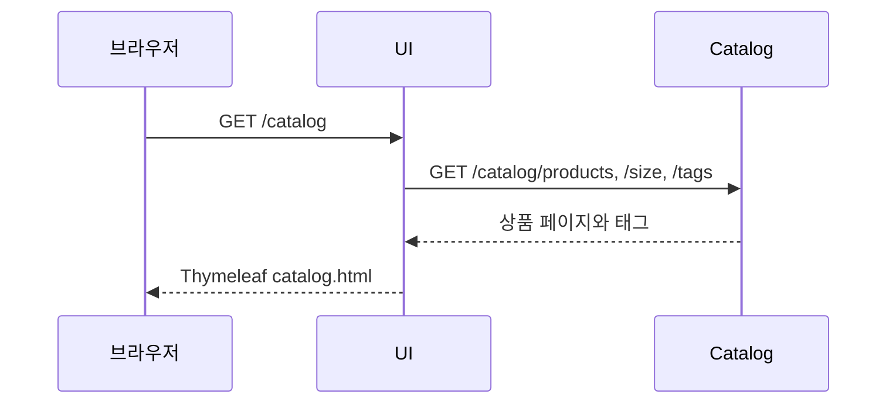
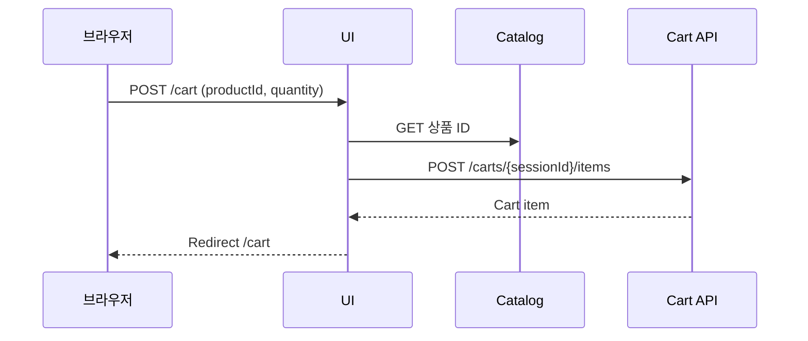
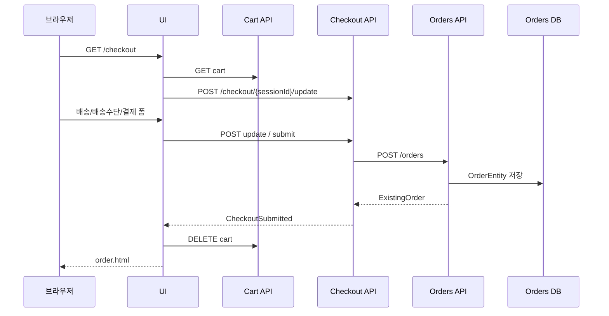
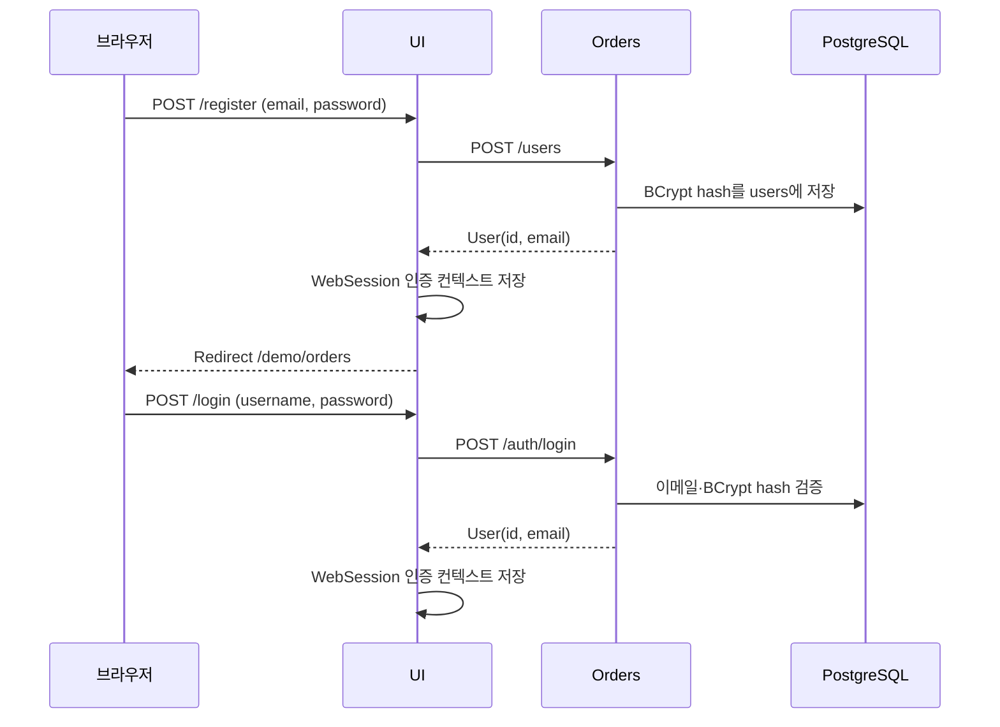
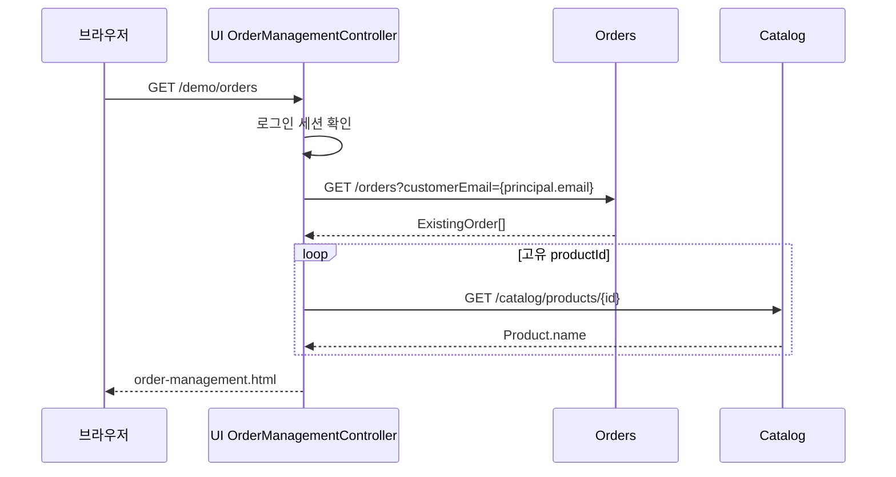

# 요청 및 데이터 흐름

## 상품 조회

* UI route: `ui/web/CatalogController.java`
* UI client: `ui/services/catalog/KiotaCatalogService.java`
* Catalog route: `catalog/main.go`
* 처리: `catalog/controller/controller.go` → `api/catalog.go` → `repository/`
* UI Catalog endpoint가 비어 있으면 원격 호출 대신 `MockCatalogService`를 사용한다.

## 장바구니 추가

`templates/fragments/product_card.html`은 `product.id`를 hidden `productId`로 전송한다. `CartController`가 세션 ID를 얻고, `KiotaCartsService`가 Catalog 상품을 확인한 후 Cart API에 item을 생성한다. Cart API의 흐름은 `CartsController` → `CartService` → 선택된 persistence다.

## Checkout과 주문 생성

1. `ui/web/CheckoutController.java`가 `CheckoutService`를 호출한다.
2. `ui/services/checkout/KiotaCheckoutService.java`가 Cart item에서 `CheckoutRequest`를 만든다.
3. `checkout/checkout.service.ts`가 상태를 저장하고 submit 때 `ordersService.create`를 호출한다.
4. `checkout/orders/HttpOrdersService.ts`가 실제 endpoint가 있을 때 `POST /orders`를 호출한다.
5. `orders/web/OrderController.java` → `OrderService` → repository가 저장하고 after-save 이벤트를 발행한다.

Checkout은 성공한 submit 뒤 상태를 삭제한다. UI는 `KiotaCheckoutService.submit`에서 Cart 삭제를 함께 수행하므로, 제출 의미를 수정할 때 두 작업의 실패 처리를 확인해야 한다.

로그인된 사용자가 배송 정보를 제출하면 `CheckoutController`는 폼의 이메일 대신 WebSession Principal의 이메일을 배송지에 설정한다. 비로그인 Checkout은 기존처럼 폼 이메일을 사용한다.

## 회원가입과 로그인

## 주문 관리 데모 화면

미인증 요청은 `/login`으로 리디렉션된다. Orders 목록 실패는 오류 화면으로, 개별 Catalog 조회 실패는 `productId` 표기로 처리한다. 이 화면은 주문을 생성하거나 Orders DB를 변경하지 않는다.
