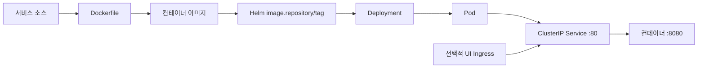

# 배포 관계

## 빌드·배포 경로

이미지 registry 게시 workflow는 이 저장소에 없다. Helm values의 기본 이미지는 공개 upstream ECR repository다. 이미지 교체·태그 게시·registry 생성은 현재 로컬 코드에서 확인되지 않는다.

## Dockerfile

| 서비스 | 빌드/런타임 |
| --- | --- |
| UI, Cart, Orders | Amazon Linux 2023 다단계 빌드, Maven·Corretto 21로 JAR 생성, UID 1000으로 production profile 실행 |
| Catalog | Amazon Linux 2023에서 Go binary 빌드, UID 1000으로 `/app/main` 실행 |
| Checkout | Node 20 Alpine에서 build, Amazon Linux 2023 Node 20 runtime에서 `node dist/main.js` 실행 |

관련 파일은 `src/{ui,cart,catalog,checkout,orders}/Dockerfile`이다.

## Helm 연결

| 서비스 | Deployment | readiness probe | Service target | 선택적 상태 의존성 |
| --- | --- | --- | --- | --- |
| UI | `ui/chart/templates/deployment.yaml` | `/actuator/health/readiness` | named `http`, 8080 | 없음 |
| Catalog | `catalog/chart/templates/deployment.yaml` | `/health` | named `http`, 8080 | MySQL, OpenSearch |
| Cart | `cart/chart/templates/deployment.yaml` | `/actuator/health/readiness` | named `http`, 8080 | DynamoDB Local |
| Checkout | `checkout/chart/templates/deployment.yaml` | `/health` | named `http`, 8080 | Redis |
| Orders | `orders/chart/templates/deployment.yaml` | `/actuator/health/readiness` | named `http`, 8080 | PostgreSQL, RabbitMQ |

각 chart에는 ConfigMap, ServiceAccount, HPA, PDB, test-connection 템플릿이 있다. 기본 values에서 HPA와 PDB는 비활성이고 ServiceAccount는 활성이다. 기본 IRSA/IAM annotation은 없다.

Orders Pod를 PostgreSQL provider로 배포하면 Spring Boot 시작 시 Flyway가 `V2__Users.sql`을 적용한다. 따라서 RDS 연결 정보와 테이블 생성 권한이 유효하면 `users` 테이블은 별도 SQL 실행 없이 생성된다.

## 네트워크 경로

* 외부: UI만 Ingress 템플릿을 가진다. 기본적으로 비활성이므로 port-forward, Service 노출 변경 또는 Compose host port가 필요하다.
* 내부: caller가 환경변수 endpoint URL로 대상에 연결한다. Helm은 UI→backend 또는 Checkout→Orders를 자동 연결하지 않는다.
* Compose: hostname은 개별 Compose project 안에서만 유효하다. UI Compose를 단독 실행해도 Catalog·Cart·Checkout·Orders에 자동 연결되지 않는다.

`app/` 안에서 Terraform, Helm umbrella chart 외 별도 Kubernetes manifest, CI/CD workflow는 발견되지 않았다.
