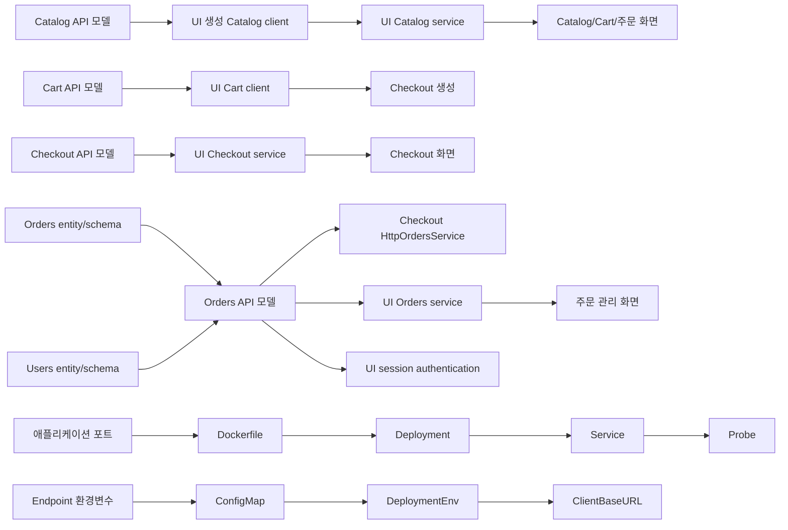

# 변경 영향도 맵

## 핵심 전파 경로

## 영향도 표

| 변경 대상 | 직접 영향 | 간접 영향 | 확인 파일 | 위험도 |
| --- | --- | --- | --- | --- |
| Catalog 상품 response | Catalog handler/model | UI catalog, cart 보강, 주문 관리 상품명 | Catalog OpenAPI, UI client/mapper/template | High |
| Cart item 모델 | Cart controller/service | UI cart, Checkout request | Cart OpenAPI, UI Cart service, Checkout mapper | High |
| Checkout request/response | Nest controller/service | UI Checkout 흐름·완료 화면 | Checkout DTO, UI 생성 client, UI page | High |
| Orders item/order response | Orders payload/MapStruct | Checkout submit, 주문 관리 | Orders OpenAPI/mapper/entity, Checkout·UI client | High |
| Orders entity/schema | JDBC entity/migration | `/orders`, 주문 관리, event/metrics | entity, migration, repository, PostgreSQL test | High |
| Users entity/schema | JDBC entity/migration | 회원가입·로그인, RDS Flyway 적용 | User entity/repository/service, `V2__Users.sql`, API/UI 테스트 | High |
| Orders 인증 API | Orders OpenAPI/controller | UI Kiota client, WebSession 로그인 | `openapi.yml`, generated client, `SecurityConfig`, login/register 화면 | High |
| 로그인 Principal 이메일 | UI 세션·Checkout controller | 생성 주문의 배송지 이메일, 개인 주문 조회 | `SecurityConfig`, `CheckoutController`, `OrderManagementController` | High |
| UI endpoint URL | StoreServices 선택 | 모든 원격 호출 | UI ConfigMap/values, deployment env, 대상 Service | High |
| Checkout Orders endpoint | provider 선택 | 실제 주문 생성 여부 | Checkout config, ConfigMap 조건, Orders URL | High |
| 서비스 포트 | server listener | Docker, Service, probe, metrics, ingress | app config, Dockerfile, Compose, chart | High |
| Catalog 검색 설정 | OpenSearch 초기화 | `/catalog/search` | Go config, ConfigMap/Secret, OpenSearch chart | Medium |
| Cart persistence provider | 구현 선택 | 장바구니 내구성 | Cart config, DynamoDB resources, tests | Medium |
| Orders messaging provider | event provider | downstream event delivery | messaging config, Secret/ConfigMap, broker | Medium |
| template 스타일 | HTML 출력 | 사용자 경험 | template와 shared fragment | Low |

위험도는 비즈니스 우선순위가 아니라 확인된 계약·설정 계층의 수를 기준으로 했다.
